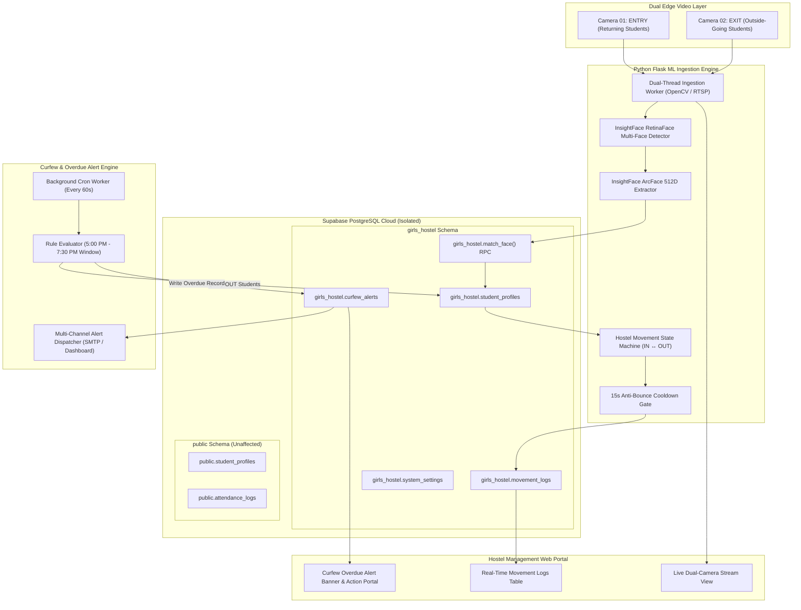
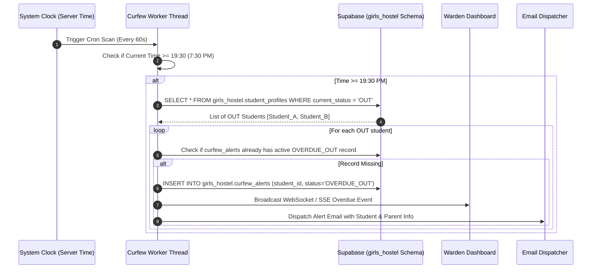

# 📐 System Architecture & End-to-End Blueprint — BioSecure AI: Girls Hostel System

## 1. System Vision
The **BioSecure AI - Girls Hostel System** is an enterprise-grade automated gate security and curfew monitoring application. It handles simultaneous multi-face detection across two cameras, maintains student entry/exit state transitions, and enforces strict curfew policies (System Start: **5:00 PM / 17:00**, Curfew Deadline: **7:30 PM / 19:30**).

Crucially, the entire system operates under complete database isolation within a dedicated PostgreSQL schema (`girls_hostel`), ensuring zero interference with existing academic attendance or other institutional datasets.

---

## 2. End-to-End Modular Architecture

---

## 3. Detailed Data Flow Architecture

### 3.1 Exit Gate Event Flow (`CAM_02_EXIT`)
1. Student approaches Exit Gate between 5:00 PM and 7:30 PM.
2. `CAM_02_EXIT` captures frame $\to$ RetinaFace detects face bounding box $\to$ ArcFace extracts 512D embedding vector.
3. System executes `girls_hostel.match_face(query_embedding, threshold=0.40)`.
4. Result returned: Student matched (`roll_number`, `name`, `current_status`).
5. Anti-bounce check validates last movement timestamp (> 15 seconds).
6. State Machine transitions student `current_status` from `'IN'` $\to$ `'OUT'`.
7. Record created in `girls_hostel.movement_logs` (`direction = 'OUT'`, `camera_id = 'CAM_02_EXIT'`, `timestamp = now()`).
8. Live movement feed on Warden Dashboard updates instantly.

### 3.2 Entry Gate Event Flow (`CAM_01_ENTRY`)
1. Student returns to Entry Gate.
2. `CAM_01_ENTRY` captures frame $\to$ Face matched via `girls_hostel.match_face`.
3. State Machine transitions student `current_status` from `'OUT'` $\to$ `'IN'`.
4. Record created in `girls_hostel.movement_logs` (`direction = 'IN'`, `camera_id = 'CAM_01_ENTRY'`, `timestamp = now()`).
5. If student had an active overdue alert, system marks the alert status as `'RESOLVED'` with `resolved_at = now()`.

---

## 4. Curfew Enforcement Architecture

---

## 5. Schema Isolation Verification Matrix

| Entity | `girls_hostel` Schema (New) | `public` Schema (Existing) | Impact |
|---|---|---|---|
| **Student Profiles** | `girls_hostel.student_profiles` | `public.student_profiles` | **100% Isolated** |
| **Attendance / Logs** | `girls_hostel.movement_logs` | `public.attendance_logs` | **100% Isolated** |
| **Curfew / Overdue** | `girls_hostel.curfew_alerts` | N/A | **100% Isolated** |
| **Vector Match RPC** | `girls_hostel.match_face()` | `public.match_face()` | **100% Isolated** |
| **System Settings** | `girls_hostel.system_settings` | N/A | **100% Isolated** |
