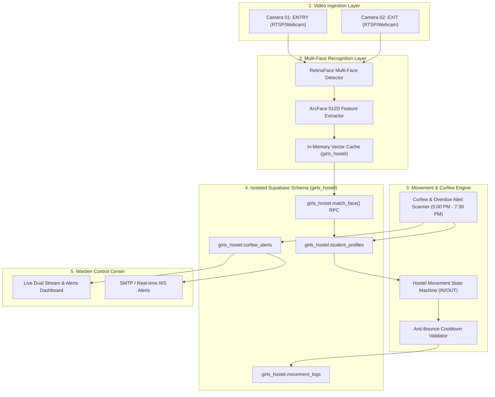
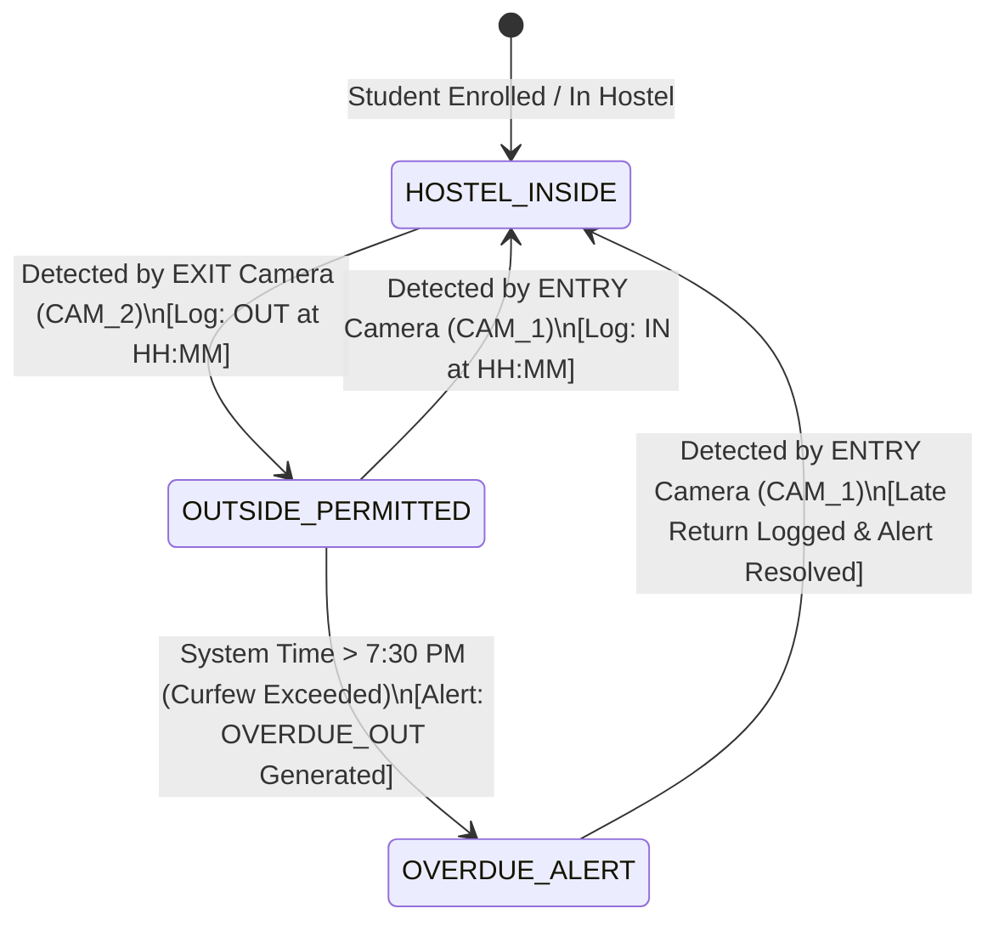

# 🏗️ Functional Architecture Document (FAD) — BioSecure AI: Girls Hostel System

## 1. Functional Overview
The Functional Architecture of **BioSecure AI - Girls Hostel Edition** breaks down the system into modular functional units responsible for stream ingestion, multi-face vector processing, state machine tracking, curfew monitoring, and isolated database persistence.

---

## 2. Functional Component Decomposition

---

## 3. Detailed Component Descriptions

### 3.1 Dual Video Stream Ingestion Module (`src/utils/hostel_camera.py`)
- **Functions**:
  - Captures video frames from `CAM_01_ENTRY` and `CAM_02_EXIT` via OpenCV RTSP/HTTP/USB threads.
  - Applies dynamic frame-skipping ($N=3$ frames) to optimize CPU/GPU utilization.
  - Emits normalized RGB frames along with camera origin tag (`ENTRY` vs `EXIT`).

### 3.2 Multi-Face Detection & Vector Matcher (`src/utils/hostel_face.py`)
- **Functions**:
  - Detects all face bboxes simultaneously in each frame using InsightFace `buffalo_l`.
  - Extracts 512D normalized ArcFace embeddings for every detected face.
  - Performs vector similarity lookup against `girls_hostel` in-memory cache and falls back to `girls_hostel.match_face` RPC.

### 3.3 Movement State Machine & Cooldown Engine (`src/utils/hostel_state.py`)
- **Functions**:
  - **State Machine Rules**:
    - If `camera_id == EXIT_CAM` and `student.current_status == 'IN'`:
      - Transition `current_status` $\to$ `'OUT'`.
      - Record `movement_logs(direction='OUT')`.
      - Set `last_movement_time = now()`.
    - If `camera_id == ENTRY_CAM` and `student.current_status == 'OUT'`:
      - Transition `current_status` $\to$ `'IN'`.
      - Record `movement_logs(direction='IN')`.
      - Set `last_movement_time = now()`.
  - **Anti-Bounce Cooldown**:
    - Discards duplicate face matches for the same student occurring within $\le 15\text{ seconds}$ on the same camera.

### 3.4 Curfew & Overdue Alert Scanner (`src/services/curfew_service.py`)
- **Functions**:
  - Configured with `CURFEW_START_TIME = "17:00"` (5:00 PM) and `CURFEW_END_TIME = "19:30"` (7:30 PM).
  - Runs periodic background checks (every 60 seconds).
  - When system time $\ge \text{CURFEW\_END\_TIME}$:
    - Selects all students from `girls_hostel.student_profiles` where `current_status = 'OUT'`.
    - Generates or updates overdue records in `girls_hostel.curfew_alerts`.
    - Dispatches alerts to Warden Dashboard and triggers warning emails/SMS.

### 3.5 Isolated Database Layer (`girls_hostel` Schema)
- **Functions**:
  - Encapsulates all data structures inside PostgreSQL `girls_hostel` schema.
  - Exposes dedicated schema-scoped RPC functions so `public` schema operations remain completely unaware of hostel data.

---

## 4. Student Movement Lifecycle & State Transitions

---

## 5. Functional Interfaces & API Mapping
- `POST /api/hostel/process_frame`: Ingest frame from Entry/Exit camera and update state.
- `GET /api/hostel/live_status`: Returns total students `IN`, total students `OUT`, and active overdue count.
- `GET /api/hostel/overdue_students`: Returns detailed list of students currently `OUT` past 7:30 PM.
- `POST /api/hostel/curfew_config`: Update curfew start/end window parameters.
