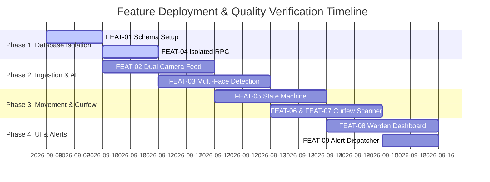

# 🎯 Feature Tracking & Lifecycle (FTL) — BioSecure AI: Girls Hostel System

## 1. Feature Lifecycle Overview
This document tracks all features, capabilities, and technical modules for the **BioSecure AI - Girls Hostel Edition**. Every feature progresses through 5 lifecycle stages: `CONCEPT` $\to$ `SPECIFIED` $\to$ `IN_DEVELOPMENT` $\to$ `TESTING` $\to$ `PRODUCTION_READY`.

---

## 2. Master Feature Matrix

| Feature ID | Feature Name | Description | Priority | Status | Schema Scope | Dependencies |
|---|---|---|---|---|---|---|
| **FEAT-01** | `girls_hostel` Schema Migration | Isolated PostgreSQL schema with tables, HNSW vector index, and RPC. | `P0 (Critical)` | `SPECIFIED` | `girls_hostel` | Supabase `pgvector` |
| **FEAT-02** | Dual Camera Ingestion | Ingestion threads for Entry Cam (Cam 1) and Exit Cam (Cam 2). | `P0 (Critical)` | `SPECIFIED` | None | OpenCV / RTSP |
| **FEAT-03** | Multi-Face ArcFace Extraction | Detect & extract 512D embeddings for up to 10 faces/frame. | `P0 (Critical)` | `SPECIFIED` | None | InsightFace `buffalo_l` |
| **FEAT-04** | Isolated Vector Match RPC | `girls_hostel.match_face` similarity matching. | `P0 (Critical)` | `SPECIFIED` | `girls_hostel` | FEAT-01 |
| **FEAT-05** | Movement State Machine | Transition logic between `IN` and `OUT` with anti-bounce cooldown. | `P0 (Critical)` | `SPECIFIED` | `girls_hostel` | FEAT-04 |
| **FEAT-06** | Curfew Window Manager | Configurable monitoring window (5:00 PM start, 7:30 PM deadline). | `P0 (Critical)` | `SPECIFIED` | `girls_hostel` | FEAT-05 |
| **FEAT-07** | Overdue Alert Engine | Automatic background scanner flagging students `OUT` past 7:30 PM. | `P0 (Critical)` | `SPECIFIED` | `girls_hostel` | FEAT-06 |
| **FEAT-08** | Warden Real-Time Dashboard | Live feeds, Movement Logs table, and Overdue Alert cards. | `P1 (High)` | `SPECIFIED` | `girls_hostel` | FEAT-07 |
| **FEAT-09** | SMTP / Webhook Alert Dispatcher | Automatic email/SMS notification to warden on curfew breach. | `P1 (High)` | `SPECIFIED` | `girls_hostel` | FEAT-07 |
| **FEAT-10** | Student Profile & Face Registration | Upload student details, parent contacts, room number, and face photos. | `P1 (High)` | `SPECIFIED` | `girls_hostel` | FEAT-01 |

---

## 3. Detailed Feature Breakdown & Acceptance Gates

### FEAT-01: `girls_hostel` Schema Isolation
- **Gate Criteria**:
  - [ ] SQL migration script creates `girls_hostel` schema.
  - [ ] Tables `student_profiles`, `movement_logs`, `curfew_alerts`, `system_settings` created under `girls_hostel`.
  - [ ] `girls_hostel.match_face()` RPC function deployed.
  - [ ] Zero access or reference to `public` schema tables.

### FEAT-02 & FEAT-03: Dual Camera Multi-Face Detection
- **Gate Criteria**:
  - [ ] Entry camera feed (`CAM_01_ENTRY`) and Exit camera feed (`CAM_02_EXIT`) read simultaneously.
  - [ ] Frame rate $\ge 15\text{ FPS}$ with sub-200ms processing delay.
  - [ ] Accurately identifies multiple faces in single group frames.

### FEAT-05: Movement State Machine & Cooldown
- **Gate Criteria**:
  - [ ] Exit detection updates student status from `IN` to `OUT` and records exit log.
  - [ ] Entry detection updates student status from `OUT` to `IN` and records entry log.
  - [ ] 15-second cooldown suppresses consecutive duplicate reads on the same camera.

### FEAT-06 & FEAT-07: Curfew & Overdue Alert Engine
- **Gate Criteria**:
  - [ ] Curfew window configured (5:00 PM start, 7:30 PM deadline).
  - [ ] Automatic cron job at 7:30 PM flags all students with `current_status = 'OUT'`.
  - [ ] Overdue entries created in `girls_hostel.curfew_alerts`.
  - [ ] Warden Dashboard reflects overdue status instantly.

---

## 4. Verification & QA Matrix

