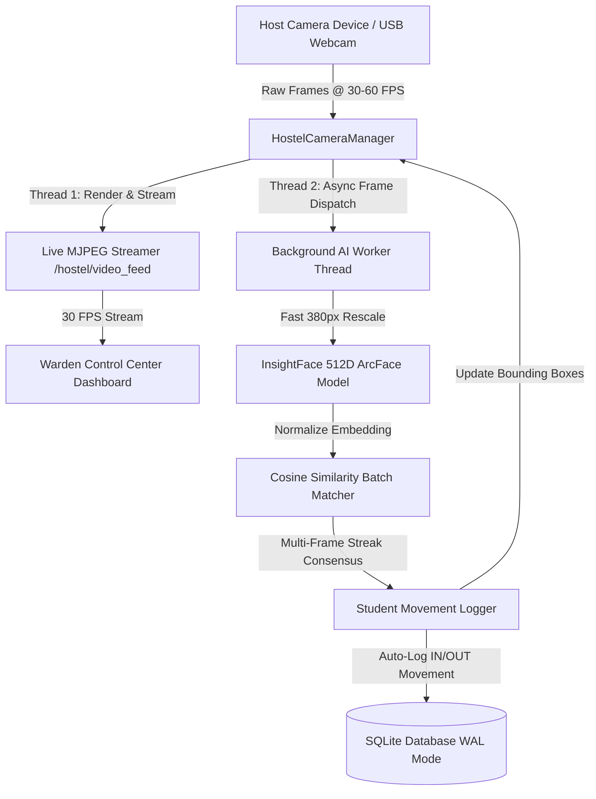

<div align="center">

# 👧 Biosecure AI — Girls Hostel Attendance & Gate Security System
### COER University, Roorkee

**Enterprise Facial Recognition Security Platform with Asynchronous High-FPS Live Camera Streaming, Multi-Frame Consensus, and Pose-Gated EWMA Biometric Embedding Drift Detection**

[](https://www.python.org/)
[](https://flask.palletsprojects.com/)
[](https://github.com/deepinsight/insightface)
[](https://opencv.org/)
[](https://www.sqlite.org/)
[](https://tailwindcss.com/)

</div>

---

## 📖 System Overview

**BioSecure AI** is an enterprise-grade automated biometric attendance and gate security system engineered for institutional student hostels. Built for **COER University Girls Hostel**, the platform replaces manual register entry with real-time, non-contact facial recognition at entry/exit gates.

The system features a **High-FPS Multithreaded OpenCV + InsightFace Engine** that decouples 30 FPS video streaming from CPU-intensive AI inference, ensuring ultra-smooth camera playback on warden dashboards while maintaining instant student identification and auto-logging entry/exit movements.

Additionally, BioSecure AI embeds a **Pose-Gated EWMA Biometric Drift Accumulator** that tracks subtle facial template aging over time (hairstyles, eyewear, facial maturity) and alerts administrators before recognition failures occur.

---

## 🏗️ System Architecture



### Key Performance Innovations:
1. **Asynchronous Multithreaded Engine**: Camera frame capture (`_camera_loop`) and AI face inference (`_ai_worker_loop`) execute on independent background threads. Video streaming never stutters or drops frames during compute-heavy AI scans.
2. **Native MJPEG Multipart Streaming**: Web clients connect via a single persistent HTTP connection (`/hostel/video_feed`), rendering live 30 FPS video streams directly in standard `` tags without client-side polling.
3. **Dual-Tier Verification & Streak Consensus**:
   * **High-Confidence Instant Pass**: Cosine similarity $\ge 0.36$.
   * **Consensus Verification Pass**: Cosine similarity $\ge 0.28$ across 2 consecutive frames.
   * **Quality Gate**: Filters out background faces smaller than $35\text{px}$.

---

## ✨ Enterprise Features

| Category | Feature | Description |
|---|---|---|
| **Gate Security** | 📹 **Live Dual Gate Stream** | Simultaneous monitoring of Entry (CAM 01) and Exit (CAM 02) host system cameras. |
| **Biometric AI** | 🧠 **InsightFace ArcFace 512D** | Deep neural embedding extraction yielding sub-millisecond similarity matching. |
| **Movement Logging** | 🔄 **Auto IN/OUT State Machine** | Automatic student movement log creation with configurable cooldown (15s default). |
| **Enrollment** | 🎯 **Guided Camera Alignment** | Interactive face positioning oval with centering, scale, and multi-face error checks. |
| **Drift Monitoring** | 📈 **EWMA Drift Engine** | Proactive tracking of template degradation using Exponentially Weighted Moving Averages. |
| **Curfew Tracking** | ⏰ **Automated Curfew Engine** | Automatic classification of student gate movements during designated curfew hours. |
| **Role-Based Access** | 🔐 **RBAC Authorization** | Access controls for Warden, System Admin, and Academic Officers. |

---

## 📂 Enterprise Project Structure

```
BioSecure AI - GIrls Hostel/
├── docs/                        # Complete System Documentation Hub
│   ├── index.md                 # Documentation Portal Index
│   ├── architecture.md          # Architecture & Multithreaded Camera Specs
│   ├── api_reference.md         # Full REST & MJPEG API Specification
│   ├── database.md              # SQLite Schema & Movement Log Tables
│   ├── deployment.md            # Production Setup (Nginx, Gunicorn, Systemd)
│   ├── ml_pipeline.md           # InsightFace 512D ML & EWMA Drift Math
│   ├── user_guide.md            # Warden & Admin User Manual
│   └── specifications/          # Archive & System Specs (PRD, SAD, TAD, FAD)
├── nginx/                       # Reverse Proxy Configuration
│   └── nginx.conf               # Production Nginx Config with Streaming Buffering
├── scripts/                     # SQL Scripts & Schema Definitions
│   └── girls_hostel_schema.sql  # Database Initialization Script
├── src/                         # Application Source Code
│   ├── blueprints/              # Modular Flask Blueprints (Routes & Handlers)
│   │   ├── admin.py             # Admin Dashboard & Drift Routes
│   │   ├── attendance.py        # Attendance Processing Routes
│   │   ├── auth.py              # User Authentication & Login
│   │   ├── hostel.py            # Hostel Warden & Live Video Feed Routes
│   │   └── students.py          # Student Directory & Enrollment Routes
│   ├── services/                # Core Business Services
│   │   ├── curfew_service.py    # Curfew Rules & Violation Processor
│   │   └── hostel_camera.py     # Multithreaded Camera Engine & Stream Manager
│   ├── static/                  # Static Assets (CSS & JS)
│   │   ├── css/style.css        # Enterprise Dark Glassmorphism Styles
│   │   └── js/                  # Front-End Camera & UI Scripts
│   ├── templates/               # Jinja2 HTML Templates
│   ├── utils/                   # Database & Biometric Helper Utilities
│   └── config.py                # Environment Configuration Constants
├── tests/                       # Automated Test Suite (Pytest)
│   ├── e2e/                     # End-to-End Test Scenarios
│   └── unit/                    # Unit Tests for DB, Rules, and ML Helpers
├── app.py                       # Application Entrypoint (Development)
├── wsgi.py                      # WSGI Entrypoint (Production Gunicorn)
├── gunicorn.conf.py             # Production Gunicorn Worker Settings
├── start_hostel.sh              # Unix/Linux Startup Script
├── start_hostel.bat             # Windows Startup Script
└── requirements.txt             # Python Package Dependencies
```

---

## 🚀 Quick Start Guide

### Prerequisites
* Python 3.10+
* OpenCV system dependencies (`libgl1-mesa-glx`, `libglib2.0-0` on Linux)
* Webcam or host video device

### 1. Clone & Setup Virtual Environment
```bash
git clone https://github.com/ArnavPundir22/BioSecure-AI---girls-Hostel-COER.git
cd "BioSecure AI - GIrls Hostel"

python3 -m venv .venv
source .venv/bin/activate  # On Windows: .venv\Scripts\activate
pip install -r requirements.txt
```

### 2. Environment Configuration
Copy the example environment configuration:
```bash
cp .env.example .env
```

### 3. Run Development Server
```bash
# Using startup script
chmod +x start_hostel.sh
./start_hostel.sh

# Or directly with Python
python app.py
```
Access the dashboard at `http://localhost:5000`.

---

## ⚙️ Production Deployment

For enterprise production deployments, use Gunicorn behind an Nginx reverse proxy:

```bash
# Start Gunicorn WSGI Server
gunicorn -c gunicorn.conf.py wsgi:app
```

### Nginx Streaming Optimization:
Ensure `proxy_buffering off;` is set in Nginx for `/hostel/video_feed` to prevent frame buffering delay:
```nginx
location /hostel/video_feed {
    proxy_pass http://127.0.0.1:5000;
    proxy_buffering off;
    proxy_cache off;
    proxy_set_header Connection '';
    proxy_http_version 1.1;
    chunked_transfer_encoding off;
}
```

---

## 🧪 Testing & Quality Assurance

Run the automated Pytest test suite:
```bash
# Execute unit and end-to-end tests
pytest
```

---

## 📚 Documentation Index

For detailed technical specifications, explore the [`docs/`](file:///home/dell/BioSecure%20AI%20-%20GIrls%20Hostel/docs) hub:
* 📖 **[Documentation Hub Index](file:///home/dell/BioSecure%20AI%20-%20GIrls%20Hostel/docs/index.md)**
* 🏗️ **[System Architecture & Multithreading Guide](file:///home/dell/BioSecure%20AI%20-%20GIrls%20Hostel/docs/architecture.md)**
* 🔌 **[API Reference Guide](file:///home/dell/BioSecure%20AI%20-%20GIrls%20Hostel/docs/api_reference.md)**
* 🗄️ **[Database & Movement Logs Schema](file:///home/dell/BioSecure%20AI%20-%20GIrls%20Hostel/docs/database.md)**
* 🌍 **[Production Deployment & Nginx Guide](file:///home/dell/BioSecure%20AI%20-%20GIrls%20Hostel/docs/deployment.md)**
* 📑 **[Specifications Directory](file:///home/dell/BioSecure%20AI%20-%20GIrls%20Hostel/docs/specifications)**

---

## 📄 License & Intellectual Property

Copyright © 2026 COER University, Roorkee. All Rights Reserved.  
*BioSecure AI — Girls Hostel Security System* contains patent-pending biometric embedding drift accumulation technology.
