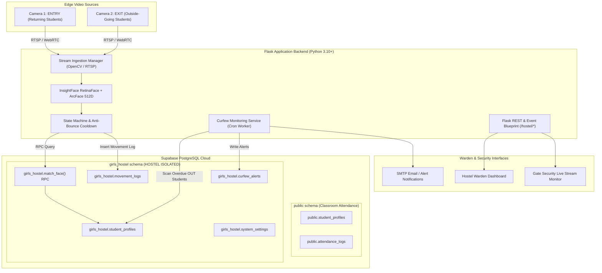
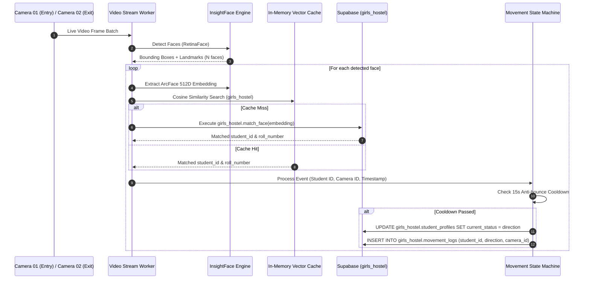

# 🏛️ System Architecture Document (SAD) — BioSecure AI: Girls Hostel System

## 1. Architectural Principles & Vision
The architecture of **BioSecure AI - Girls Hostel Edition** is built around three core pillars:
1. **Isolated Data Domain**: The entire data model is encapsulated inside a dedicated `girls_hostel` PostgreSQL schema. This ensures zero data leakage, zero shared sequence collision, and zero operational impact on other projects (such as academic classroom attendance).
2. **Real-Time Dual Stream Computer Vision Pipeline**: Multithreaded frame acquisition from two distinct cameras (`CAM_01_ENTRY` and `CAM_02_EXIT`) feeding a parallel InsightFace vector extraction engine.
3. **Automated Event-Driven Curfew Engine**: Continuous time-aware monitoring that checks student state (`IN`/`OUT`) against configurable curfew bounds (5:00 PM - 7:30 PM) and publishes real-time overdue alerts.

---

## 2. High-Level System Topology



---

## 3. Data Isolation Architecture & Boundary Control

### 3.1 Database Schema Isolation Strategy
To guarantee complete independence from other projects:
- **Dedicated Schema**: All tables are created under `girls_hostel.*`.
- **Dedicated Functions**: Vector search RPC function is registered as `girls_hostel.match_face()`.
- **Index Isolation**: HNSW cosine distance index is created on `girls_hostel.student_profiles(embedding vector_cosine_ops)`.
- **Application Connection Scoping**: Supabase backend clients execute schema-scoped SQL queries, preventing accidental table hits in `public`.

```sql
-- Schema Creation
CREATE SCHEMA IF NOT EXISTS girls_hostel;

-- Table Scoping Example
CREATE TABLE girls_hostel.student_profiles (
    id UUID PRIMARY KEY DEFAULT gen_random_uuid(),
    name VARCHAR(255) NOT NULL,
    roll_number VARCHAR(100) UNIQUE NOT NULL,
    room_number VARCHAR(50) NOT NULL,
    hostel_block VARCHAR(50) DEFAULT 'Block-A',
    parent_contact VARCHAR(20) NOT NULL,
    embedding VECTOR(512),
    current_status VARCHAR(20) DEFAULT 'IN', -- 'IN' or 'OUT'
    last_movement_time TIMESTAMP WITH TIME ZONE,
    current_ewma_drift FLOAT DEFAULT 0.0,
    drift_alert_level VARCHAR(50) DEFAULT 'HEALTHY',
    created_at TIMESTAMP WITH TIME ZONE DEFAULT CURRENT_TIMESTAMP
);
```

---

## 4. Multi-Face Camera Ingestion Pipeline



---

## 5. Security & Row-Level Access Policy
- **Database Row Level Security (RLS)**:
  - Enabled on `girls_hostel.student_profiles`, `girls_hostel.movement_logs`, and `girls_hostel.curfew_alerts`.
  - Direct public access via `anon` role is **DENIED**.
  - Read access for authenticated warden users is restricted via role policy.
  - Flask backend uses `SUPABASE_SERVICE_ROLE_KEY` to execute administrative writes safely.
