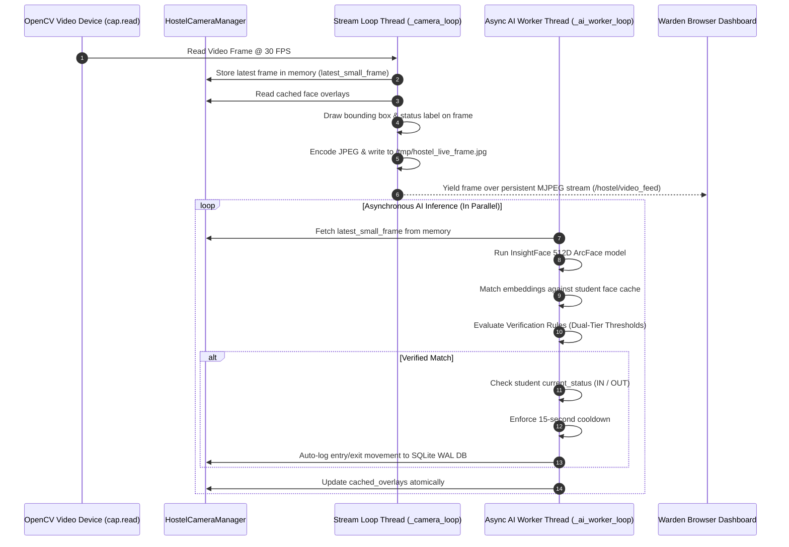

# 🏗️ System Architecture Guide

This document describes the design patterns, application structure, and execution lifecycles of **BioSecure AI — Girls Hostel Management Platform**, including both the **High-FPS Multithreaded Live Camera Engine** and the **Biometric Embedding Drift Engine**.

---

## 📁 Enterprise Directory Structure

BioSecure AI follows an enterprise **Modular Flask Blueprint** architecture:

```
BioSecure AI - GIrls Hostel/
├── docs/                        # Complete System Documentation Hub
│   ├── index.md                 # Documentation Portal Index
│   ├── architecture.md          # Architecture & Multithreaded Camera Specs
│   ├── api_reference.md         # Full REST & MJPEG API Specification
│   ├── database.md              # SQLite Schema & Movement Log Tables
│   ├── deployment.md            # Production Setup (Nginx, Gunicorn, Systemd)
│   ├── ml_pipeline.md           # InsightFace 512D ML & EWMA Drift Math
│   ├── user_guide.md            # Warden & Admin User Manual
│   └── specifications/          # Architecture, PRD, SAD, TAD, FAD Specs
├── nginx/                       # Reverse Proxy Configuration
├── scripts/                     # Database Schemas & Setup Scripts
├── src/                         # Application Source Code
│   ├── __init__.py            # Flask Application Factory
│   ├── config.py              # Configuration & Threshold Constants
│   ├── blueprints/            # Blueprint Route Modules (Controllers)
│   │   ├── admin.py           # User management, /admin/drift, resets
│   │   ├── attendance.py      # Attendance processing & manual marks
│   │   ├── auth.py            # Session authentication & login
│   │   ├── hostel.py          # Warden control center & /hostel/video_feed
│   │   └── students.py        # Student records & guided enrollment
│   ├── services/              # Core Services Layer
│   │   ├── curfew_service.py  # Curfew violations processor
│   │   └── hostel_camera.py   # Asynchronous High-FPS Multithreaded Camera Engine
│   ├── utils/                 # Utilities & Biometric Helpers
│   │   ├── hostel_db.py       # SQLite WAL database operations
│   │   ├── face.py            # InsightFace ArcFace 512D inference
│   │   └── face_cache.py      # In-memory numpy matrix face matching
│   ├── templates/             # Jinja2 HTML Templates
│   └── static/                # CSS, JS, and asset files
├── tests/                       # Automated Test Suite (Pytest)
├── app.py                       # Development Entrypoint
├── wsgi.py                      # Production WSGI Entrypoint
├── gunicorn.conf.py            # Gunicorn Server Settings
├── start_hostel.sh              # Unix/Linux Service Launcher
├── start_hostel.bat             # Windows Service Launcher
└── requirements.txt             # Dependency Definitions
```

---

## 🔄 Multithreaded Camera Engine & Video Streaming Architecture

To guarantee **30+ FPS video streaming** on warden dashboards while executing compute-heavy InsightFace AI detection on CPU, camera frame capture is decoupled from AI inference using two dedicated background threads:



---

## ⚡ Concurrency & Scaling Principles

1. **Decoupled Video & AI Loop**: Video frames flow to the client at hardware speed (30–60 FPS) without pausing for AI inference.
2. **Configurable Frame Skipping**: `CAMERA_FRAME_SKIP_COUNT` (default `4`) allows tuning AI detection frequency. Face recognition runs asynchronously every $N$ frames (~120–150ms), keeping bounding box updates responsive while preserving smooth 30 FPS video playback.
3. **Dashboard Frame Refresh Control**: Front-end dashboards update live camera elements using `CAMERA_REFRESH_INTERVAL_MS` (default `40` ms / ~25 FPS) for fluid video playback without browser rendering lag.
4. **Persistent Native MJPEG Streaming**: Serves live camera video via a single HTTP multipart connection (`/hostel/video_feed`), eliminating client-side HTTP GET polling overhead.
5. **Process-Level Lock**: Uses `fcntl.flock` on `/tmp/hostel_camera_device.lock` so that only one primary Gunicorn worker opens the physical USB camera device, avoiding hardware conflicts.
6. **SQLite WAL (Write-Ahead Logging) Mode**: Configured with `PRAGMA journal_mode=WAL` and `PRAGMA busy_timeout=5000` to allow concurrent database reads and writes across multiple threads and worker processes.

