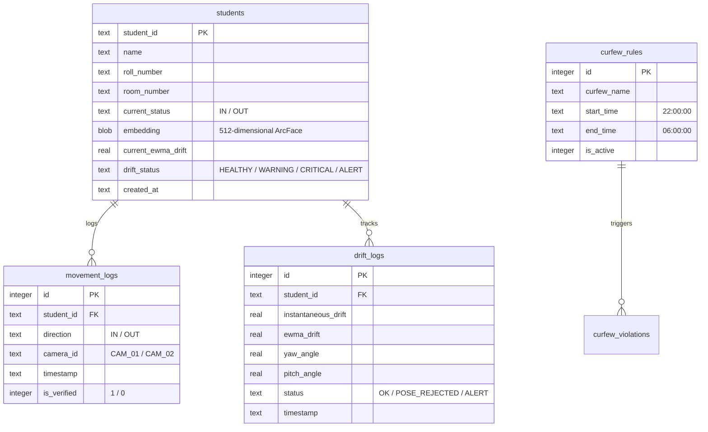

# 🗄️ Database Schema & Storage Architecture

BioSecure AI utilizes **SQLite with Write-Ahead Logging (WAL) Mode** (`PRAGMA journal_mode=WAL`) for ultra-fast, zero-latency local database storage. The database manages student profiles, face embeddings, gate entry/exit movement logs, EWMA embedding drift metrics, and curfew violation records.

---

## 📊 Entity Relationship Diagram



---

## 🛠️ SQLite WAL Table Schema Definition (`scripts/girls_hostel_schema.sql`)

```sql
PRAGMA journal_mode=WAL;
PRAGMA busy_timeout=5000;

-- 1. Student Master Table
CREATE TABLE IF NOT EXISTS students (
    student_id TEXT PRIMARY KEY,
    name TEXT NOT NULL,
    roll_number TEXT UNIQUE NOT NULL,
    room_number TEXT,
    branch TEXT DEFAULT 'CSE',
    gmail TEXT,
    current_status TEXT DEFAULT 'IN',  -- IN / OUT
    embedding BLOB,                    -- 512D ArcFace normalized float32 array
    current_ewma_drift REAL DEFAULT 0.0,
    drift_status TEXT DEFAULT 'HEALTHY',-- HEALTHY / WARNING / CRITICAL / ALERT
    created_at DATETIME DEFAULT CURRENT_TIMESTAMP
);

-- 2. Movement Entry/Exit Logs Table
CREATE TABLE IF NOT EXISTS movement_logs (
    id INTEGER PRIMARY KEY AUTOINCREMENT,
    student_id TEXT NOT NULL,
    direction TEXT NOT NULL,           -- IN / OUT
    camera_id TEXT NOT NULL,            -- CAM_01 (Entry) / CAM_02 (Exit)
    timestamp DATETIME DEFAULT CURRENT_TIMESTAMP,
    is_verified INTEGER DEFAULT 1,
    FOREIGN KEY(student_id) REFERENCES students(student_id)
);

-- 3. Biometric Drift History Logs
CREATE TABLE IF NOT EXISTS drift_logs (
    id INTEGER PRIMARY KEY AUTOINCREMENT,
    student_id TEXT NOT NULL,
    instantaneous_drift REAL NOT NULL,
    ewma_drift REAL NOT NULL,
    yaw_angle REAL,
    pitch_angle REAL,
    status TEXT DEFAULT 'OK',
    timestamp DATETIME DEFAULT CURRENT_TIMESTAMP,
    FOREIGN KEY(student_id) REFERENCES students(student_id)
);

-- 4. Curfew Management Rules
CREATE TABLE IF NOT EXISTS curfew_rules (
    id INTEGER PRIMARY KEY AUTOINCREMENT,
    curfew_name TEXT NOT NULL,
    start_time TEXT NOT NULL,           -- e.g. "22:00"
    end_time TEXT NOT NULL,             -- e.g. "06:00"
    is_active INTEGER DEFAULT 1
);
```

---

## ⚡ Concurrency & Performance Settings

* **Journal Mode (`WAL`)**: Write-Ahead Logging allows background AI worker threads to write movement logs while web routes perform concurrent reads without lock contention.
* **Busy Timeout (`5000ms`)**: Ensures database connections wait up to 5 seconds if a transaction is being written, preventing `database is locked` exceptions.
