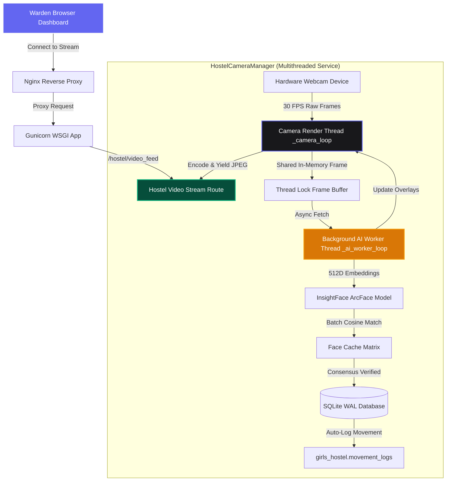

# 🛡️ BioSecure AI — Technical Documentation Hub
### COER University, Roorkee

Welcome to the official technical documentation portal for **BioSecure AI — Girls Hostel Attendance & Gate Security System**.

BioSecure AI is an enterprise-grade automated biometric attendance and gate security system featuring a **High-FPS Multithreaded OpenCV Camera Engine**, **InsightFace 512D ArcFace Recognition**, **Multi-Frame Consensus Verification**, and a **Pose-Gated EWMA Embedding Drift Engine**.

---

## 🗺️ Documentation Hub Navigation

Explore the system through our core documentation modules:

| Document | Description | Key Contents |
| :--- | :--- | :--- |
| 🏗️ **[System Architecture](architecture.md)** | Multithreaded camera engine & system design | Decoupled 30 FPS video streaming thread, Async AI worker thread, SQLite WAL DB |
| 🔌 **[API Reference](api_reference.md)** | Full REST & MJPEG streaming manual | `/hostel/video_feed`, `/process_frame`, `/submit_student`, `/admin/drift` |
| 🗄️ **[Database & Movement Logs](database.md)** | Storage layer & SQLite schemas | `students`, `movement_logs`, `curfew_rules`, SQLite WAL configuration |
| 🧠 **[ML & Inference Pipeline](ml_pipeline.md)** | Facial recognition & drift algorithms | InsightFace ArcFace 512D embeddings, RetinaFace alignment, 3D Pose Gate, EWMA math |
| 🌍 **[Production Ops & Deployment](deployment.md)** | Deployment setup & performance tuning | Gunicorn WSGI configuration, Nginx reverse proxy with zero-buffer streaming |
| 👤 **[User & Warden Guide](user_guide.md)** | Warden & admin operational manual | Interactive guided enrollment, live gate monitoring, curfew tracking, drift resets |
| 📑 **[System Specifications](specifications/)** | Specifications directory | System Architecture Docs (PRD, SAD, TAD, FAD, Rules, Test Infrastructure) |

---

## 🏗️ High-FPS Multithreaded Architecture Overview

---

## ⚡ Technical Highlights

- **Decoupled 30 FPS Video Streaming**: Camera streaming is decoupled from AI inference, ensuring live feeds on warden dashboards never freeze or drop frames.
- **Persistent MJPEG Multipart Stream**: Uses native HTTP multipart streams (`multipart/x-mixed-replace`) for zero-latency camera rendering in standard `` tags.
- **Dual-Tier Verification Thresholds**:
  - `HIGH_CONFIDENCE_THRESHOLD = 0.36`: Instant match.
  - `MIN_MATCH_THRESHOLD = 0.28`: Base threshold requiring 2 consecutive frame consensus.
- **SQLite WAL Mode**: Thread-safe database operations (`PRAGMA journal_mode=WAL`) optimized for concurrent reads and movement logging writes.
